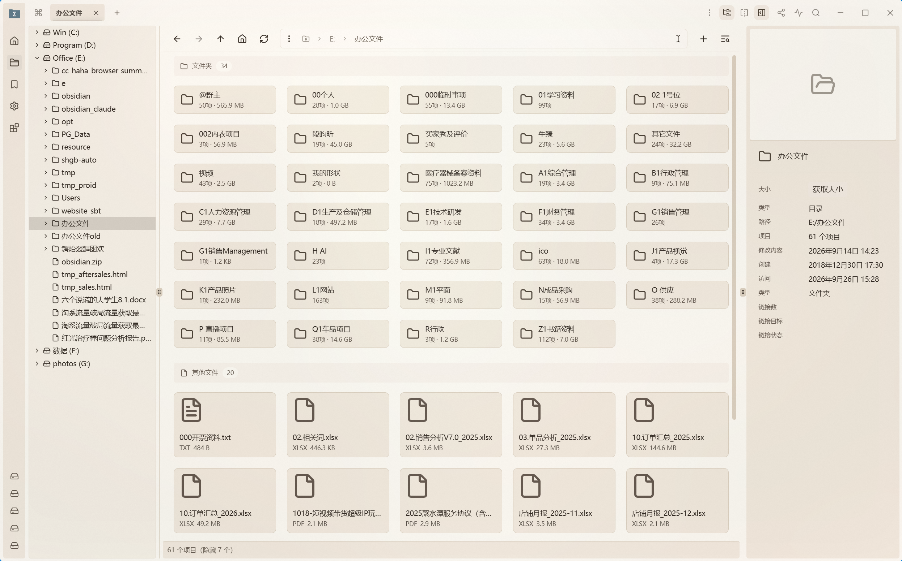

**[English](README.md)** | **[中文](README.zh-CN.md)**

<h1>
  
  &nbsp;&nbsp;Sigma File Manager（kizemo 分支）
</h1>

"Sigma File Manager" 是一款免费、开源、迭代迅速、面向 Windows 与 Linux 的现代文件管理器（资源管理器 / Finder 类）应用。

本仓库是 [kizemo](https://github.com/kizemo) 维护的个人分支，跟随上游 [`aleksey-hoffman/sigma-file-manager`](https://github.com/aleksey-hoffman/sigma-file-manager) 同步，并在其基础上新增目录树视图与其他易用性改进。

**下载分支预构建版本**：[**v2.2.0-tree.1 — Folder Tree Sidebar**](https://github.com/kizemo/sigma-file-manager/releases/tag/v2.2.0-tree.1) —— 基于 `feat/tree-sidebar-v6-1` 分支（HEAD `8caf14ae`）构建的 Windows NSIS 安装包。本分支**未**购买代码签名证书，首次启动时 Windows SmartScreen 会提示"未知发布者"，选择**更多信息 → 仍要运行**即可。安装包 sha256：`c63ef9194c1e284e983a06d22c4e85f54eef9c5f9c18c0105570b18de58b2f35`。

## 目录树侧边栏（分支核心功能）

左侧新增 **目录树侧边栏**，实时映射文件系统并跟随当前激活面板，让你随时看到当前位置，也可以一键跳转到任意上级或下级目录。

- **开关位置**：在导航工具栏上新增一个独立的 `FolderTree` 图标按钮。该按钮**没有**放进布局下拉菜单，始终保持一键可达。
- **同步来源**：目录树会自动跟随地址栏、收藏夹 / 快捷访问面板，以及**分屏视图中的激活面板**，每个分屏各自维护独立的展开状态。
- **单路径展开**：导航时仅保留当前路径的祖先链展开，其余之前展开过的分支会自动折叠，目录树保持紧凑、便于浏览。
- **点击语义**：点击行内容即跳转到该目录；点击行首的折叠箭头仅展开或折叠该分支，不会改变当前目录。
- **驱动器标签**：根节点同时显示卷标与盘符，例如 `Win (C:)`，在多 WSL / 多硬盘环境下也能一目了然地分辨盘符。
- **状态持久化**：显示 / 隐藏状态通过 `userSettings.navigator.showFolderTree` 保存，重启后自动恢复。
- **实现分支**：[`feat/tree-sidebar-v6-1`](https://github.com/kizemo/sigma-file-manager/tree/feat/tree-sidebar-v6-1)，HEAD `8caf14ae` —— 共 6 个原子提交，含测试与文档约 3000 行代码。
- **测试**：259 个单元测试全部通过。
- **上游追踪**：本工作对应上游 issue [#499](https://github.com/aleksey-hoffman/sigma-file-manager/issues/499)。

## 即将推出

- **文件选择对话框焦点同步**（Listary 风格）：当其他应用调用 Sigma 自带文件选择对话框时，地址栏 / 目录树会自动聚焦到调用方所在的目录。仅作用于 Sigma 自己的选择器，不挂全局系统钩子。实现方案位于元仓库的 `docs/superpowers/plans/2026-09-26-dialog-focus-sync.md`，待选择器相关基础设施就绪后即移植到本分支。

## 致谢

- 上游：[aleksey-hoffman/sigma-file-manager](https://github.com/aleksey-hoffman)，作者 [Aleksey Hoffman](https://github.com/aleksey-hoffman)。所有产品功能、品牌与发布流程均归属于上游。
- 分支维护者：[kizemo](https://github.com/kizemo)。

## 许可证

GPL-3.0-or-later —— 详见 [`LICENSE.md`](./LICENSE.md)。本分支新增内容同样以该许可证发布。